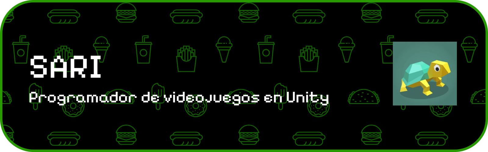

# Bienvenid@ al GitHub de SARI 

👩🏻‍💻 Programador Junior de C# para Unity

👨🏻‍🎓 Estudio Diseño y desarrollo de videojuegos más R.A. en SENATI

💭 Actualmente estudio de forma autodidacta y sigo mejorando

# 💻Tecnologías

